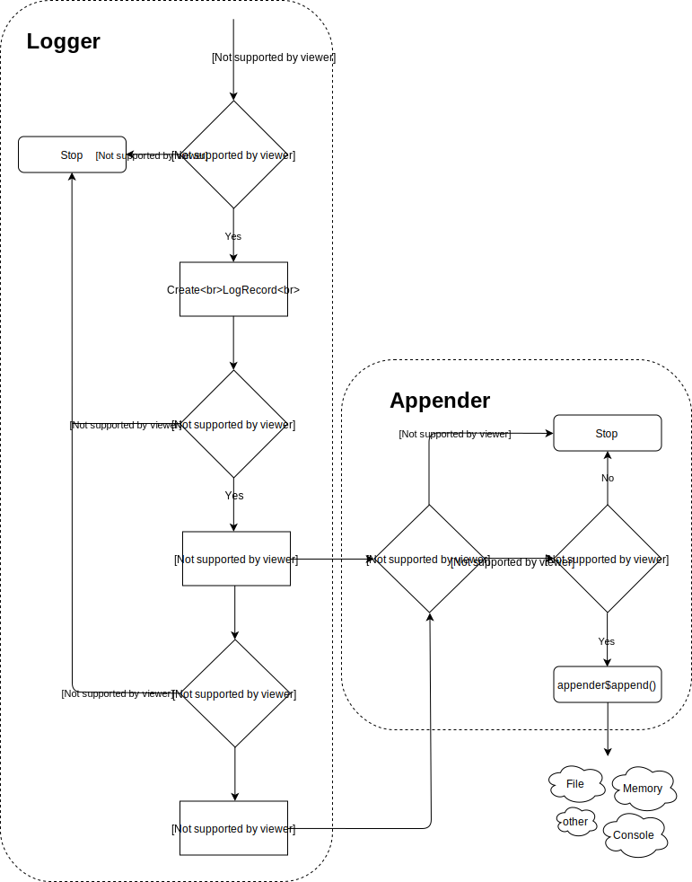

```{r setup, include = FALSE}
library(yog)

knitr::opts_chunk$set(
  collapse = TRUE,
  comment = "#>"
)
```

Yog is an [Apache Log4j](https://logging.apache.org/log4j/2.x/) inspired
logging framework based on [R6 classes](https://github.com/r-lib/R6) that 
focuses on extensibility, ease of use, and the ability to use multiple 
appenders with custom thresholds for a single logger.

# Basic usage

Yog comes with a pre-configured logger included. You can just start logging 
with:

```{r}
yog$info("This is an informational message")
yog$fatal("This is an important message about something going wrong")

yog$debug("Debug messages are hidden by default")
yog$threshold <- "debug"
yog$debug("Unless we lower the threshold")


```

This only logs to the console. If you want to redirect the output to a file
you can just add a file appender to yog

```{r}
tf <- tempfile()

# Add a new appender to a logger. We don't have to supply a name, but that
# makes it easier to remove later.
yog$add_appender(AppenderFile$new(file = tf), "tempfile_appender")

yog$info("Another informational message")
yog$debug("A debug message that the console appender doesn't show.")

readLines(tf)

# Remove the appender again
yog$remove_appender("tempfile_appender")
```

# Structure

* A **Logger** collects information and dispatches it to the appropriate appenders
* An **Appender** writes the log message to destination (the console, a file, 
  a database, etc...)
* A **Layout** is


## Log Levels

Yog supports the standard log4j log levels outlined bellow. Log levels have
numeric and character representations. Creation of custom log levels are not 
yet supported by yog.

```{r, echo = FALSE}

ll <- data.frame(
  `Level` = seq(100, 600, by = 100),
  `Name` = c("FATAL", "ERROR", "WARNING", "INFO", "DEBUG", "TRACE"),
  `Description` = c(
    "Critical error that leads to program abort. Should always indicate a `stop()` or similar",
    "A severe error that does not trigger program abort",
    "A potentially harmful situation, like `warning()`",
    "An informatinal message on the progress of the application",
    "Finer grained informational messages that are mostly useful for debugging",
    "An even finer grained message than debug"
  )
) 

knitr::kable(ll)

```


# Hierarchical Loggers



